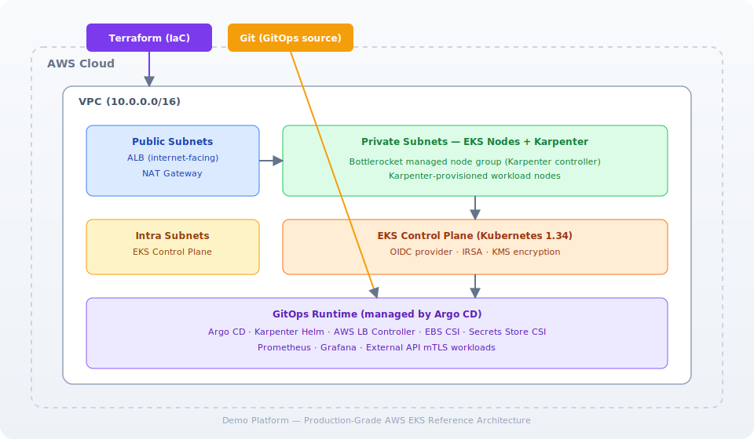

# Demo Platform — Production-Grade AWS EKS Platform

<p align="center">
  
</p>

<p align="center">
  A production-ready, open-source reference implementation of an AWS EKS Kubernetes platform built with Terraform, Argo CD GitOps, Karpenter, and observability stack.
</p>

<p align="center">
  
  
  
  
  
  
  
</p>

---

## Overview

**Demo Platform** is a complete, production-grade platform engineering reference repository. It provisions a multi-environment AWS EKS Kubernetes platform using Terraform and manages the runtime layer with Argo CD GitOps.

The goal of this repository is to serve as an educational and production reference for:

- **Infrastructure as Code** with modular Terraform
- **GitOps** with Argo CD and Kustomize/Helm
- **Platform Engineering** with Karpenter autoscaling and IRSA
- **DevSecOps** with least-privilege IAM, private networking, and secret management
- **Observability** with Prometheus, Grafana, and the kube-prometheus-stack

> This repository is a generalized, company-agnostic reference implementation. All names, domains, and identifiers are placeholders — replace them with your own values before deploying.

---

## Architecture

<p align="center">
  
</p>

The platform follows a clear separation of concerns:

| Layer            | Tool             | Responsibility                                            |
|------------------|------------------|-----------------------------------------------------------|
| **Infrastructure** | Terraform        | VPC, EKS cluster, node groups, IAM, Karpenter AWS-side    |
| **Runtime**        | Argo CD (GitOps) | Helm charts, Kubernetes manifests, add-ons, workloads     |
| **Autoscaling**    | Karpenter        | Node provisioning and deprovisioning based on pod demand  |
| **Networking**     | AWS VPC + ALB    | Public/private subnets, internal/external load balancers  |
| **Security**       | IRSA + Secrets   | Pod identity, Secrets Store CSI, mTLS to external APIs     |
| **Observability**  | Prometheus stack | Metrics, dashboards, alerting                             |

See [`docs/architecture.md`](docs/architecture.md) for the full design.

---

## Features

- **Modular Terraform** — reusable modules for VPC, EKS, IAM, IRSA, Karpenter, and security groups
- **Multi-environment** — isolated `dev`, `staging`, and `prod` environments with per-env state
- **Remote state** — S3 backend with DynamoDB locking and KMS encryption
- **GitOps runtime** — Argo CD manages all Kubernetes add-ons and workloads
- **Karpenter autoscaling** — demand-based node provisioning with interruption handling
- **IRSA** — IAM Roles for Service Accounts for least-privilege pod identity
- **AWS Load Balancer Controller** — ALB/NLB ingress management
- **EBS CSI Driver** — persistent volumes via IRSA
- **Secrets Store CSI** — mount AWS Secrets Manager material as Kubernetes secrets
- **External API mTLS** — reference pattern for calling external APIs with mTLS certificates
- **Observability** — Prometheus, Grafana, and kube-prometheus-stack via GitOps
- **Security hardening** — private subnets, security groups, KMS-encrypted state, least-privilege IAM

---

## Repository Structure

```text
.
├── README.md                    # Project overview and quick start
├── LICENSE                      # MIT license
├── CONTRIBUTING.md              # How to contribute
├── CODE_OF_CONDUCT.md           # Community standards
├── MIGRATION.md                 # Safe state migration plan
├── docs/                        # In-depth documentation
│   ├── architecture.md
│   ├── networking.md
│   ├── security.md
│   ├── terraform.md
│   ├── gitops.md
│   ├── eks.md
│   ├── monitoring.md
│   └── disaster-recovery.md
├── assets/                      # Diagrams and logo assets
│   ├── logo.svg
│   └── architecture.svg
├── terraform/                   # All infrastructure code
│   ├── bootstrap/
│   │   └── backend/             # S3, DynamoDB, KMS for remote state
│   ├── modules/                 # Reusable Terraform modules
│   │   ├── vpc/
│   │   ├── eks/
│   │   ├── iam/
│   │   ├── irsa/
│   │   ├── karpenter/
│   │   └── security/
│   └── environments/            # Per-environment configurations
│       ├── dev/
│       ├── staging/
│       └── prod/
├── examples/                    # Worked configuration examples
│   └── terraform/
└── .github/                     # CI/CD and community files
    ├── workflows/
    ├── ISSUE_TEMPLATE/
    └── PULL_REQUEST_TEMPLATE.md
```

> **Note:** Terraform files currently live at the repository root for backward compatibility. The canonical layout above (`terraform/...`) is the target structure documented in [`docs/terraform.md`](docs/terraform.md).

---

## Technologies

| Category        | Technology                                         |
|-----------------|----------------------------------------------------|
| Cloud           | AWS (EKS, VPC, IAM, S3, DynamoDB, KMS, Secrets Manager) |
| IaC             | Terraform ≥ 1.14, AWS provider 6.22                |
| Container       | Kubernetes 1.34, Bottlerocket nodes                |
| GitOps          | Argo CD, Kustomize, Helm                           |
| Autoscaling     | Karpenter                                          |
| Networking      | AWS Load Balancer Controller, VPC CNI              |
| Storage         | EBS CSI Driver, Secrets Store CSI Driver           |
| Observability   | Prometheus, Grafana, kube-prometheus-stack        |
| CI/CD           | GitHub Actions                                     |

---

## Quick Start

### Prerequisites

- Terraform ≥ 1.14
- AWS CLI configured with credentials
- `kubectl`
- `helm`
- Argo CD CLI (optional, for bootstrapping)

### 1. Bootstrap the Terraform backend

```bash
cd terraform/bootstrap/backend
terraform init
terraform apply
```

This creates the S3 state bucket, DynamoDB lock table, and KMS key.

### 2. Provision an environment

```bash
cd terraform/environments/dev
terraform init
terraform plan
terraform apply
```

### 3. Bootstrap Argo CD

After the cluster is up, install Argo CD and point it at your GitOps repository:

```bash
kubectl create namespace argocd
helm install argocd argo/argo-cd -n argocd
kubectl apply -f examples/argocd/root-app.yaml
```

Argo CD then reconciles all runtime add-ons and workloads from Git.

---

## Infrastructure Workflow

```text
Developer → Git commit → CI validation → Terraform plan → Review → Terraform apply → AWS
```

1. Infrastructure changes are made in `terraform/modules/` or `terraform/environments/`.
2. A pull request triggers `terraform fmt`, `validate`, and `terraform plan` in CI.
3. After review and merge, `terraform apply` provisions the change in the target environment.
4. Each environment maintains its own remote state file in the shared S3 backend.

See [`docs/terraform.md`](docs/terraform.md) for the full workflow and module reference.

---

## GitOps Workflow

```text
Git (source of truth) → Argo CD (reconciler) → Kubernetes cluster
```

1. All Kubernetes runtime components (add-ons, workloads) are declared in a GitOps repository.
2. Argo CD continuously reconciles cluster state to match Git.
3. Terraform provisions only AWS infrastructure; Argo CD owns everything inside the cluster.
4. This split prevents Terraform from managing Kubernetes runtime resources.

See [`docs/gitops.md`](docs/gitops.md) for the GitOps architecture and application set.

---

## Security

- **Least-privilege IAM** — every workload gets a scoped IRSA role
- **Private networking** — nodes run in private subnets; the API endpoint can be restricted
- **KMS-encrypted state** — Terraform state is encrypted at rest with a dedicated KMS key
- **State locking** — DynamoDB prevents concurrent state writes
- **Secrets management** — AWS Secrets Manager material is mounted via Secrets Store CSI
- **mTLS to external APIs** — reference pattern for mutual TLS to third-party services
- **No secrets in Git** — all sensitive values are references, never literals

See [`docs/security.md`](docs/security.md) for the security model and hardening checklist.

---

## CI/CD

GitHub Actions workflows automate:

- **Terraform validation** — `fmt`, `validate`, and `plan` on every pull request
- **Documentation checks** — keep README and docs in sync
- **Release tagging** — semantic versioning on merge to `main`

See [`.github/workflows/`](.github/workflows/) for workflow definitions.

---

## Screenshots

> Screenshots are welcome contributions. Please add them under `assets/screenshots/` and link them here.

| Argo CD UI | Grafana Dashboard | Karpenter Nodes |
|------------|-------------------|-----------------|
| _placeholder_ | _placeholder_ | _placeholder_ |

---

## Best Practices

- **Module separation** — each module has a single responsibility and no cross-module coupling
- **State isolation** — one state file per environment, never shared
- **GitOps over imperative** — cluster state is declarative and version-controlled
- **IRSA over node IAM** — pods assume scoped roles, never the node instance profile
- **Karpenter over cluster autoscaler** — faster, simpler, bin-packing-aware provisioning
- **Version pinning** — Terraform, providers, and Helm charts are pinned for reproducibility
- **Naming conventions** — kebab-case for resources, snake_case for Terraform variables

---

## Future Improvements

- [ ] Adopt the `terraform/` root layout (move files under `terraform/`)
- [ ] Add Terraform Cloud / Atlantis integration examples
- [ ] Add OPA Gatekeeper / Kyverno policy examples
- [ ] Add cross-region disaster recovery runbook
- [ ] Add cost estimation with Infracost in CI
- [ ] Add multi-cluster Argo CD ApplicationSet examples
- [ ] Add Loki for log aggregation alongside Prometheus

---

## Learning Objectives

This repository is designed to teach and demonstrate:

1. How to structure multi-environment Terraform with reusable modules
2. How to split infrastructure (Terraform) from runtime (GitOps) responsibilities
3. How to implement IRSA for secure pod-to-AWS access
4. How to configure Karpenter for autoscaling
5. How to manage external API integrations with mTLS and Secrets Store CSI
6. How to build a production observability stack with Prometheus and Grafana
7. How to harden AWS infrastructure with least-privilege IAM and private networking

---

## Troubleshooting

See [`docs/troubleshooting.md`](docs/troubleshooting.md) for common issues and solutions.

Common questions:

- **`terraform plan` wants to replace the cluster** — see [`MIGRATION.md`](MIGRATION.md)
- **IRSA pod gets AccessDenied** — verify the service account annotation and trust policy
- **Karpenter nodes not joining** — check the node IAM role and `EC2NodeClass`
- **Argo CD app stuck `OutOfSync`** — check the repo path and Helm values

---

## Contributing

Contributions are welcome! Please read [`CONTRIBUTING.md`](CONTRIBUTING.md) and follow the [code of conduct](CODE_OF_CONDUCT.md).

---

## License

This project is licensed under the MIT License — see [`LICENSE`](LICENSE).
